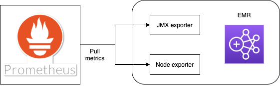

# aws-analytical-dataset-generation

The Analytical Dataset Generation (ADG) cluster converts the latest versions of all records in specified HBase tables into Parquet files stored on S3. It then
generates Hive tables to provide downstream data processing & analytics tasks
with convenient SQL access to that data.

# Overview


1. At a defined time, a CloudWatch event will trigger the `EMR Launcher` Lambda function
1. The `EMR Launcher` reads EMR Cluster configuration files from the `Config` S3 bucket, then calls the `RunJobFlow` API of the EMR service which results in an
`Analytical Dataset Generator` (`ADG`) EMR cluster being launched
1. The `ADG Cluster` is configured as a read-replica of the `Ingest HBase` EMR
cluster; a PySpark step run on the cluster reads HBase Storefiles from the
`Input` S3 bucket and produces Parquet files in the `Output` S3 bucket.
1. The PySpark step then creates external Hive tables over those S3 objects,
storing the table definitions in a Glue database
1. Once processing is complete, the `ADG Cluster` terminates.


## Using AWS Insights for Analytical Dataset Generation analysis

As our logs go to cloudwatch, we can use AWS Insights to gather data and metrics about the ADG runs.

_Make sure you set the time range or you'll get odd results_

### Saving Insights for future use.

You can't. However, you can see previously used insights in the account (useful as you can't save them per se) by going to:
   > "CloudWatch | Logs | Insights (left menu bar) | Actions (button) | View query history for this account"

If you put a comment as the first line of a query it can do for a proxy title.

### Time taken for each Collection & Overall time taken for all Collections :
   ```
   # Time taken for each & all colletions   
   fields @timestamp , @message
   | parse @message "{ 'timestamp':* 'log_level':* 'message': 'time taken for*:*'" as timestamp ,log_level, collection, timetaken
   | display collection, timetaken
   | sort timetaken desc 
   ```

### How to add and run tests

1.	Pull the latest python3-pyspark-pytest image by running: `docker pull dwpdigital/python3-pyspark-pytest`
2.	Run: `docker run -it --rm --name adg-docker -v "$(pwd)":/install -w /install dwpdigital/python3-pyspark-pytest pytest .` 

### Known issues: 
1. make sure to delete locally generated directories  metastore_db, spark-temp, spark-warehouse directory if unit tests 
   fail when run locally
   
# Exporting application and OS metrics

To export application and OS metrics, JMX exporter and node exporter were chosen. They integrate with the existing metrics infrastructure and allow for metrics to be scraped by Prometheus.
These metrics should then be queryable in Thanos.

<br />

  

<br />
 
## JMX exporter set-up 

1.  Add jmx javagent to the [pom.xml](https://github.com/dwp/aws-analytical-dataset-generation/blob/DW-5340-documentation/bootstrap_actions/metrics_config/pom.xml) file that is used to download the jars
    
    ```
    <dependency>
        <groupId>io.prometheus.jmx</groupId>
        <artifactId>jmx_prometheus_javaagent</artifactId>
        <version>0.14.0</version>
    </dependency>
    ```
    this downloads jmx_javaagent jar from Maven. This has to happen as a bootstrap action as it needs to be present at application setup.

2. A script needs to be configured to access Maven Central where the dependencies mentioned in the pom file above can be downloaded. An example can be found [here](https://github.com/dwp/aws-analytical-dataset-generation/blob/master/bootstrap_actions/metrics-setup.sh) 
3. Create a config file for JMX exporter as explained in the Configuration section of the [Prometheus GitHub page](https://github.com/prometheus/jmx_exporter). As JMX exporter is ran as a Javaagent no URL or port needs to be specified in this file.

    ```
    ---
    lowercaseOutputName: true
    rules:
      - pattern: '.*'

    ```
   This config captures all metrics found by JMX.
   
4. Edit [cluster launch configuration](https://github.com/dwp/aws-analytical-dataset-generation/blob/DW-5340-documentation/cluster_config/configurations.yaml.tpl) to start applications with Jmx exporter running as a javaagent.

    Eg. hadoop-env configuration
    ```
   - Classification: "hadoop-env"
     Configurations:
     - Classification: "export"
       Properties:
         "HADOOP_NAMENODE_OPTS": "\"-javaagent:/opt/emr/metrics/dependencies/jmx_prometheus_javaagent-0.14.0.jar=7101:/opt/emr/metrics/prometheus_config.yml\""
         "HADOOP_DATANODE_OPTS": "\"-javaagent:/opt/emr/metrics/dependencies/jmx_prometheus_javaagent-0.14.0.jar=7103:/opt/emr/metrics/prometheus_config.yml\""
   
   ```
   Javaagent needs to be configured to start on an unused port. If running multiple agents they need to run on different ports. In the hadoop-env example 7101, 7103.  
   
5. Add an [ingress/egress security group rule](https://github.com/dwp/dataworks-metrics-infrastructure/blob/a36336d11de6ae95a5a7bbf363051a37498f47f0/peering_internal-compute.tf#L66-L86) to allow prometheus connectivity over port 9090

6. Configure [peering](https://github.com/dwp/dataworks-metrics-infrastructure/blob/a36336d11de6ae95a5a7bbf363051a37498f47f0/peering_internal-compute.tf#L1-L7) to your vpc and [routing](https://github.com/dwp/dataworks-metrics-infrastructure/blob/a36336d11de6ae95a5a7bbf363051a37498f47f0/peering_internal-compute.tf#L23-L28) to your service

7. Add an [ingress](https://github.com/dwp/dataworks-metrics-infrastructure/blob/a36336d11de6ae95a5a7bbf363051a37498f47f0/peering_internal-compute.tf#L132-L141)[egress](https://github.com/dwp/dataworks-metrics-infrastructure/blob/a36336d11de6ae95a5a7bbf363051a37498f47f0/peering_internal-compute.tf#L110-L119) security group rules to allow communication between prometheus and your service on the JMX port.

8. Add a [scrape config](https://github.com/dwp/dataworks-metrics-infrastructure/blob/master/config/prometheus/prometheus-slave.yml#L91-L108) to Prometheus to discover metrics on the JMX exporter port.

    The port defined in the config aligns with the ingress/egress rules and determines where Prometheus looks for metrics.
    This re-label config replaces instance labels that show up as IP addresses with the value of the EC2 tag Name
   
   ```
    relabel_configs:
      - source_labels: [__meta_ec2_tag_Name]
        regex: (.*)
        target_label: instance
        replacement: $1
        action: replace
   ```

    `source_labels` is what it looks for. In this case it is the value of the EC2 tag Name.  
    `regex` is the pattern to match for the source label.  
    `target_label` is the label to replace.  
    `replacement` is the regex group to be replaced with. In this case it is the value of the tag.  

9. Re-label the instances to differentiate between EMR nodes without mentioning the IP

    ```
    export AWS_DEFAULT_REGION=${aws_default_region}
    UUID=$(dbus-uuidgen | cut -c 1-8)
    TOKEN=$(curl -X PUT -H "X-aws-ec2-metadata-token-ttl-seconds: 21600" "http://169.254.169.254/latest/api/token")
    export INSTANCE_ID=$(curl -H "X-aws-ec2-metadata-token:$TOKEN" -s http://169.254.169.254/latest/meta-data/instance-id)
    export INSTANCE_ROLE=$(jq .instanceRole /mnt/var/lib/info/extraInstanceData.json)
    export HOSTNAME=${name}-$${INSTANCE_ROLE//\"}-$UUID
    hostname $HOSTNAME
    aws ec2 create-tags --resources $INSTANCE_ID --tags Key=Name,Value=$HOSTNAME
    ```
    where `name` is the service name.

## Node exporter set-up 

Node exporter is used for gathering OS metrics and comes pre-installed with the EMR AMI images.
Node exporter runs on port 9100.

To set up, repeat steps 6 to 9 of JMX exporter set-up for the node exporter port.

## Dynamo-db table

There is a dynamo-db table that exists which tracks the status of all ADG runs. This table is named `data_pipeline_metadata`. In order to populate this table, the `emr-setup` bootstrap step kicks off a shell script named `update_dynamo.sh` which runs in the background.

This script waits for certain files to exist on the local file systems. These files contain information passed to the cluster from SNS (like the correlation id) and the first step of the cluster than saves them to the files.

When the files are found, then the script updates dynamo db with a row for the current run of the cluster (when the row already exists, it's a retry scenario, see below). Then the script loops in the background for the lifecycle of the cluster. When a step is completed, the current step field is updated in dynamo db and when the cluster is finished the status is updated with the final cluster status. Cancelled clusters are set to failed.

### Retries

If a cluster fails, then the status is updated in the dynamo db table to failed. When a new cluster starts, before it inserts the new dynamo db row, it checks if one exists. If it does, then it checks the last run step and the status and if the status is failed, it saves off this status to a local file.

Whenever a step starts on a cluster, it calls a common method which checks if this local file exists. If it does not (i.e. this is not a retry scenario) then the step continues a normal. However if the file does exist, then the step checks if the failed cluster was running the same step when it failed. If it was, then it runs the step as normal and the local files is deleted so as not to affect subsequent steps. However if the step name does not match, this step is assumed to have completed before and therefore is skipped this time.

In this way, we are able to retry the entire cluster but not repeat steps that have already succeeded, therefore saving us potentially hours or time for retry scenarios.

## Concourse pipeline

There is a concourse pipeline for ADG named `analytical-dataset-generation`. The code for this pipeline is in the `ci` folder. The main part of the pipeline (the `master` group) deploys the infrastructure and runs the e2e tests. There are a number of groups for rotating passwords and there are also admin groups for each environment.

### Admin jobs

There are a number of available admin jobs for each environment.

#### Start cluster

This job will start an ADG cluster running. In order to make the cluster do what you want it to do, you can alter the following environment variables in the pipeline config and then run `aviator` to update the pipeline before kicking it off:

1. S3_PREFIX (required) -> the S3 output location for the HTME data to process, i.e. `businessdata/mongo/ucdata/2021-04-01/full`
1. EXPORT_DATE (required) -> the date the data was exported, i.e `2021-04-01`
1. CORRELATION_ID (required) -> the correlation id for this run, i.e. `generate_snapshots_preprod_generate_full_snapshots_4_full`
1. SNAPSHOT_TYPE (required) -> either `full` or `incremental` for the type of ADG to start
1. SKIP_PDM_TRIGGER (optional) -> if not provided, the environment wide terraform default is used to decide whether ADG should trigger PDM when finished - if provided must be either `true` or `false` to explicity trigger or not trigger PDM (note this only applies to ADG-full clusters, this value is ignored for ADG-incremental)

#### Stop clusters

For stopping clusters, you can run either the `stop-full-clusters` job to terminate ALL current `ADG-full` clusters on the environment or `stop-incremental-clusters` to terminate ALL current `ADG-incremental` clusters on the environment.

### Clear dynamo row (i.e. for a cluster restart)

Sometimes the ADG cluster is required to restart from the beginning instead of restarting from the failure point.
To be able to do a full cluster restart, delete the associated DynamoDB row if it exists. The keys to the row are `Correlation_Id` and `DataProduct` in the DynamoDB table storing cluster state information (see [Retries](#retries)).   
The `clear-dynamodb-row` job is responsible for carrying out the row deletion.

To do a full cluster restart

* Manually enter CORRELATION_ID and DATA_PRODUCT of the row to delete to the `clear-dynamodb-row` job and run aviator.


    ```
    jobs:
      - name: dev-clear-dynamodb-row
        plan:
          - .: (( inject meta.plan.clear-dynamodb-row ))
            config:
              params:
                AWS_ROLE_ARN: arn:aws:iam::((aws_account.development)):role/ci
                AWS_ACC: ((aws_account.development))
                CORRELATION_ID: <Correlation_Id of the row to delete>
                DATA_PRODUCT: <DataProduct of the row to delete>

    ```
* Run the admin job to `<env>-clear-dynamodb-row`

* You can then run `start-cluster` job with the same `Correlation_Id` from fresh.


# Upgrading to EMR 6.2.0

There is a requirement for our data products to start using Hive 3 instead of Hive 2. Hive 3 comes bundled with EMR 6.2.0 
along with other upgrades including Spark. Below is a list of steps taken to upgrade ADG to EMR 6.2.0  

1. Make sure you are using an AL2 ami 

2. Point ADG at the new metastore: `hive_metastore_v2` in `internal-compute` instead of the old one in the configurations.yml   

    The values below should resolve to the new metastore, the details of which are an output of `internal-compute`
    ```    
   "javax.jdo.option.ConnectionURL": "jdbc:mysql://${hive_metastore_endpoint}:3306/${hive_metastore_database_name}?createDatabaseIfNotExist=true"
   "javax.jdo.option.ConnectionUserName": "${hive_metsatore_username}"
   "javax.jdo.option.ConnectionPassword": "${hive_metastore_pwd}"
   ```

3. Create ingress/egress security group rules to the metastore in the `internal-compute` repo. Example below   

    ```
    resource "aws_security_group_rule" "ingress_adg" {
      description              = "Allow mysql traffic to Aurora RDS from ADG"
      from_port                = 3306
      protocol                 = "tcp"
      security_group_id        = aws_security_group.hive_metastore_v2.id
      to_port                  = 3306
      type                     = "ingress"
      source_security_group_id = data.terraform_remote_state.adg.outputs.adg_common_sg.id
    }
    
    resource "aws_security_group_rule" "egress_adg" {
      description              = "Allow mysql traffic to Aurora RDS from ADG"
      from_port                = 3306
      protocol                 = "tcp"
      security_group_id        = data.terraform_remote_state.adg.outputs.adg_common_sg.id
      to_port                  = 3306
      type                     = "egress"
      source_security_group_id = aws_security_group.hive_metastore_v2.id
    }
    ```

3. Rotate the `adg-writer` user from the `internal-compute` pipeline so that when ADG starts up it can login to the metastore.

4. Give IAM permissions to the ADG EMR launcher to read the new Secret  

    ```
    data "aws_iam_policy_document" "adg_emr_launcher_getsecrets" {
     statement {
       effect = "Allow"
    
       actions = [
         "secretsmanager:GetSecretValue",
       ]
    
       resources = [
         data.terraform_remote_state.internal_compute.outputs.metadata_store_users.adg_writer.secret_arn,
       ]
     }
    }
    ``` 
5. Chang the configurtations.yml change `spark.executor.extraJavaOptions` to `spark.executor.defaultJavaOptions`

6. Upgrade any dependencies that reference scala 2.11 or Spark 2.4. For ADG the metrics dependency had to be bumped to the new version of scala  

    ``` 
   <dependency>
       <groupId>com.banzaicloud</groupId>
       <artifactId>spark-metrics_2.12</artifactId>
       <version>2.4-1.0.6</version>
   </dependency>
   ```
   
7. Bump the EMR version to 6.2.0 and launch the cluster.   

Make sure that the first time anything uses the metastore it initialises with Hive 3, otherwise it will have to be rebuilt. 

# Status Metrics

In order to generate status metrics, the emr-setup bootstrap step kicks off a shell script named status_metrics.sh which runs in the background.

This script loops in the background for the lifecycle of the cluster and sends a metric called `adg_status` to the ADG pushgateway. This metric has the following
values which map to a certain cluster status

| Cluster Status  | Metric Value |
| ------------- | ------------- |
| Running    | 1
| Completed  | 2  |
| Failed  | 3  |
| Cancelled  | 4  |

